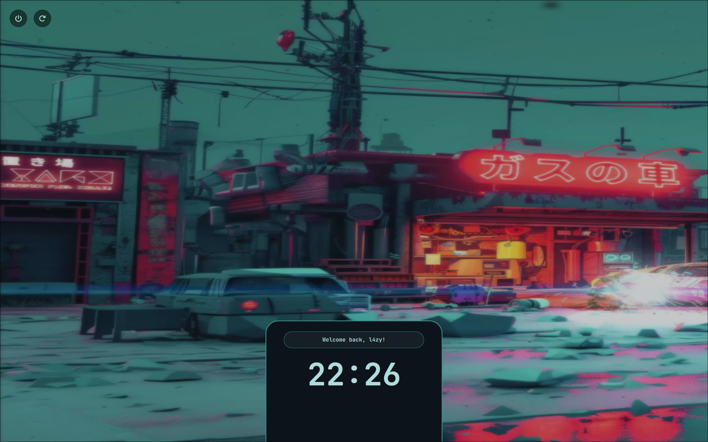
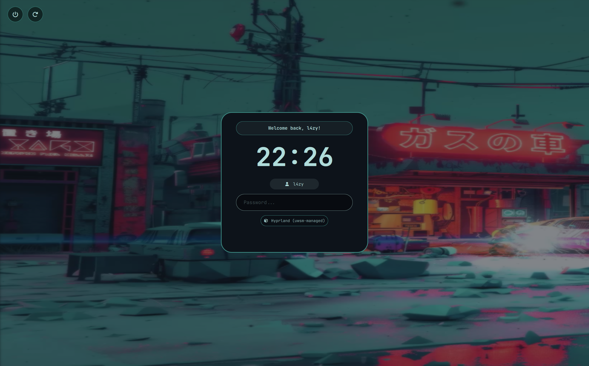
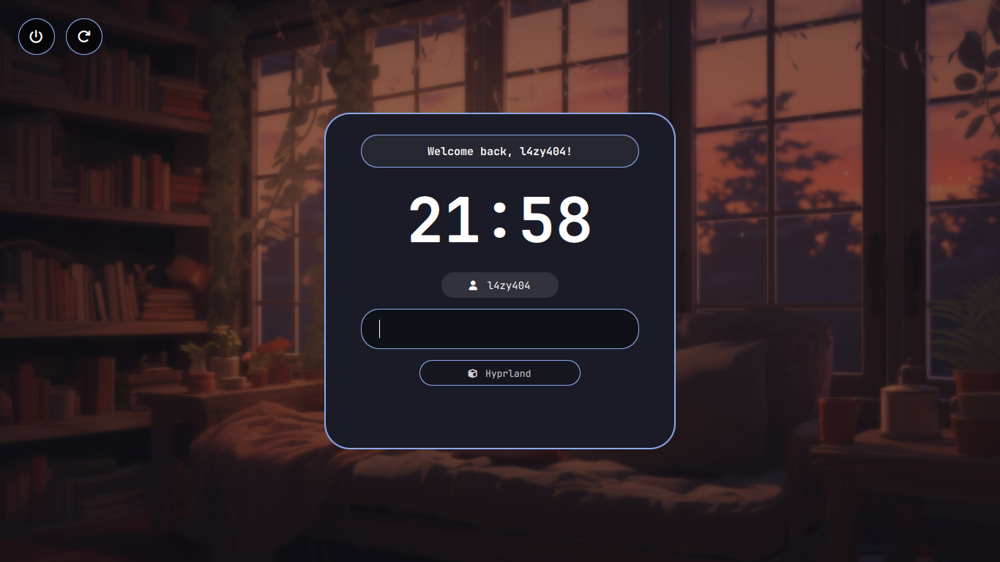

#Still work in progress!

# 🫧 Dynamic Bubble SDDM Theme
A sleek, modern, and highly interactive SDDM theme featuring **full Pywal integration**, smooth QML animations, and hardware-inspired status indicators.

---



---

## ✨ Features

* **🎨 Pywal Native Sync:** Automatically matches your current wallpaper's color scheme.
* **⏳ Smart Status Logic:** Dynamic pop-up pill providing real-time feedback for:
    * *Authenticating...*: Provides immediate feedback after pressing Enter.
    * *Incorrect Password*: Smooth red alert with UI shake.
    * *Account Lockout*: Directly displays **PAM/faillock** security messages.
* **📦 Portable & Robust:** Includes local **JetBrains Mono Nerd Font** loading. No more broken icons or missing glyphs (, , ).
* **🖱️ Interactive UI:**
    * **Hover-to-Reveal:** Login panel slides in only when the mouse is near.
    * **User/Session Selectors:** Cycle through users and desktop environments with a click.
* **👑 Sudo-Free Workflow:** Optimized permission structure allows you to update colors without constant root prompts.

---

## 🚀 Installation

### 1. Automated Install (Recommended)
Clone the repository and run the installer script:

```bash
git clone https://github.com/L4ZY404/dynamic-bubble-sddm.git && cd dynamic-bubble-sddm
```
```bash
chmod +x install.sh
```
```bash
./install.sh
```

## Note
You must have and run pywal at least one time to get your wallpaper on cache
